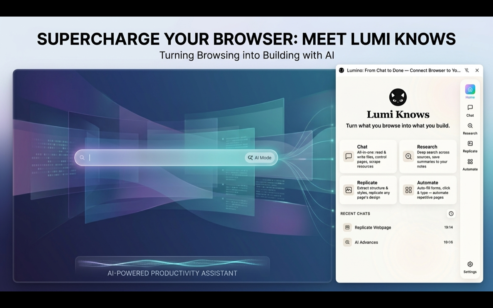

# Lumino

[中文](./README_ZH.md) | English

> Turn what you browse into what you build.

**Lumino** is a multi-modal AI assistant that lives in your browser's side panel. Powered by your own LLM (any OpenAI-compatible API), it reads web pages, scrapes designs, automates forms, manages files, and integrates with your Obsidian vault — all through a self-hosted agent loop that keeps your data private.

<p align="center">
  
</p>

## Features

### 🤖 Multi-Agent Modes

Lumino ships with four built-in agents, each tuned for a different task:

| Agent | What it does |
|---|---|
| **Chat** | All-in-one assistant — read/write files, browse pages, scrape resources |
| **Research** | Deep search across web sources, extract and save findings to notes |
| **Replicate** | Extract DOM structure, CSS styles, and resources from any page |
| **Automate** | Fill forms, click elements, press keys — automate repetitive web tasks |

You can also create **custom agents** with your own system prompts and tool subsets.

### 🛠 Rich Built-in Tools (23+)

| Category | Tools |
|---|---|
| **Page Reading** | `get_page_content` — extracts readable text via Mozilla Readability |
| **Browser Interaction** | `navigate`, `click_element`, `fill_form`, `press_key`, `scroll`, `screenshot`, `inspect_element`, `close_tab` |
| **Page Scraping** | `scrape_structure`, `scrape_styles`, `scrape_resources`, `fetch_resource` |
| **File System** | `ls`, `read_file`, `write_file`, `edit_file`, `glob`, `grep`, `rm`, `export` |
| **System** | `current_page`, `tabs` |
| **PDF** | `read_pdf` — extract text from PDFs (URL or local path) |
| **Obsidian** | Dynamic MCP tools — `vault_list`, `vault_read`, `vault_write`, and more |

### 🔒 Privacy First

- Your **API key is stored locally** in `chrome.storage.local` — never synced to the cloud
- All LLM requests go directly from your browser to your configured API endpoint
- No telemetry, no analytics, no third-party servers

### 🎨 Other Highlights

- **Three themes** — Paper, ORYZO, Fictional
- **i18n** — English / 中文 runtime switching
- **OPFS workspace** — built-in file system for storing and editing files during sessions
- **Thinking mode** — configure per-model reasoning/thinking parameters
- **Markdown rendering** — with KaTeX math support and DOMPurify sanitization

## Installation

### Option 1: Chrome Web Store

<a href="https://chromewebstore.google.com/detail/lumino-browse-and-build-w/pgmojincedjeggjgfafpkbmloiiinplj"></a>

Or search for **"Lumino"** in the [Chrome Web Store](https://chromewebstore.google.com/).

### Option 2: Manual Install

```bash
git clone https://github.com/the-invulnus/lumino.git
cd lumino
pnpm install
pnpm build
```

Then open `chrome://extensions`, enable **Developer mode**, and click **Load unpacked** to select the `build/chrome-mv3-prod/` folder.

### Option 3: Development

```bash
git clone https://github.com/the-invulnus/lumino.git
cd lumino
pnpm install
pnpm dev
```

Load the `build/chrome-mv3-dev` directory as an unpacked extension. Source changes trigger automatic rebuilds.

## Configuration

After installing, open the **Options page** (right-click the extension icon → Options) to configure:

1. **LLM Connection** — Set your OpenAI-compatible API endpoint (base URL, API key, model name). Lumino works with any provider that supports the OpenAI chat completions API, including Ollama, vLLM, Groq, DeepSeek, and local models.

2. **Obsidian Integration** *(optional)* — Enable the [Obsidian Local REST API](https://github.com/coddingtonbear/obsidian-local-rest-api) plugin, then enter your vault host and API key. The agent can then read and write notes directly.

3. **Custom Agents** *(optional)* — Create agents with custom system prompts and hand-picked tool subsets.

4. **Theme & Language** — Pick a color scheme and switch between English and Chinese.

## Usage

1. Click the Lumino icon in your Chrome toolbar to open the side panel
2. Select an agent mode from the sidebar (Chat, Research, Replicate, or Automate)
3. Type your prompt — the agent will autonomously execute tools to complete your task
4. Each tool call is shown as an expandable card so you can inspect inputs and outputs
5. Switch between conversations in the history panel

## Architecture

Lumino is built with [Plasmo](https://docs.plasmo.com/) (Chrome Extension framework), React 18, and TypeScript. It uses a custom-built agent loop (`while(true)` + tool calling) rather than relying on third-party AI SDKs.

For detailed architecture documentation, see [CLAUDE.md](./CLAUDE.md).

## Tech Stack

| Layer | Technology |
|---|---|
| Framework | [Plasmo](https://docs.plasmo.com/) 0.90.5 |
| UI | React 18 + TypeScript 5.3 |
| Agent Loop | Custom `LlmClient` + `runAgentLoop()` |
| LLM Protocol | OpenAI-compatible API |
| Schema Validation | Zod 3.25 |
| Styling | Pure CSS (three-layer: tokens / layout / components) |
| Package Manager | pnpm |
| Testing | Vitest + jsdom |
| Storage | Chrome Storage API + IndexedDB + OPFS |

## License

MIT © 2026 [the invulnus](https://github.com/the-invulnus)

## Acknowledgments

- [Mozilla Readability](https://github.com/mozilla/readability) for article extraction
- [pdf.js](https://mozilla.github.io/pdf.js/) for PDF parsing
- [KaTeX](https://katex.org/) for math rendering
- [Plasmo](https://docs.plasmo.com/) for the excellent extension framework